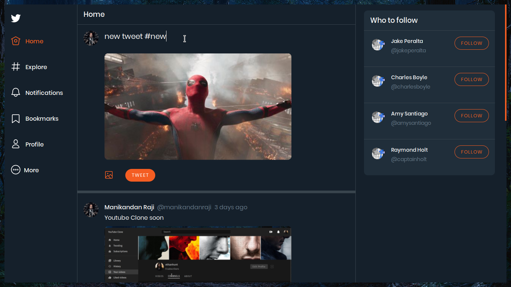
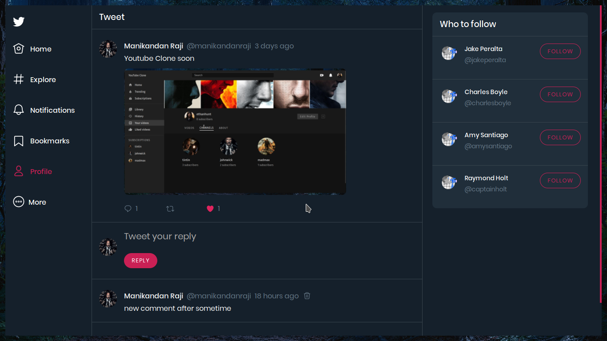

# Twitter Clone Backend

[](https://app.netlify.com/sites/twitterclone22/deploys)

Twitter clone backend built with Prisma and GraphQL.

If you are looking for the frontend repo, [click here](https://github.com/manikandanraji/twitter-clone-frontend)

Check out the [deployed site](https://twitterclone22.netlify.app)

## Core Packages

1. prisma - allows us to define our application models and generates CRUD operations from our defined models
2. graphql-yoga - graphql server
3. jsonwebtoken - authentication

# Features

- Signup / Login
- New Tweet
- Like
- Retweet
- Comment
- View Profile
- Edit Profile
- Search by users, tags, people
- Dark theme / Light theme

# How to setup locally

- You need to have a prisma account
- Make sure to install the prisma cli tool globally in your machine

	```bash
	npm i -g prisma

	# once you created your account, you can login from the terminal
	prisma login
<<<<<<< HEAD
 	```
=======
	```
>>>>>>> 2c18f50440e3704a94ab74d5730334f619cd8c37

# Deploying the backend to heroku

First create an heroku account and install the heroku cli globally and login

```bash
npm i -g heroku
heroku login
```

Once logged in, create a new heroku application and push it to the remote 'heroku'

```bash
heroku create
git push heroku master
```

Then you need to manually setup the environmental variables using the heroku dashboard

# UI

## Home


## Explore


## Profile


## Edit Profile


## New Tweet


## Tweet

